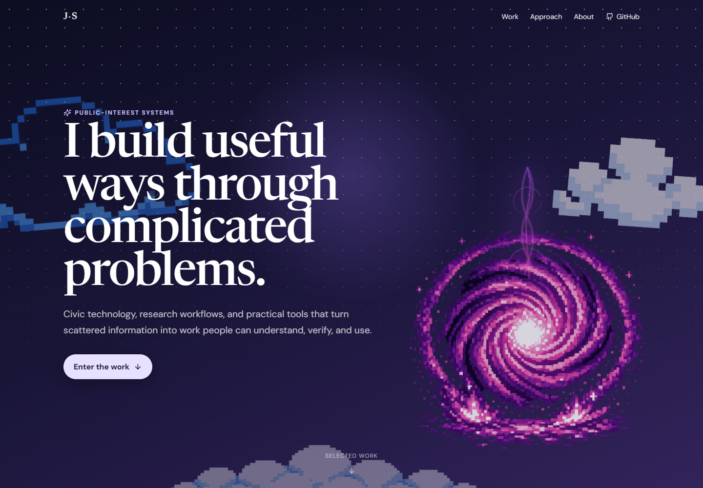
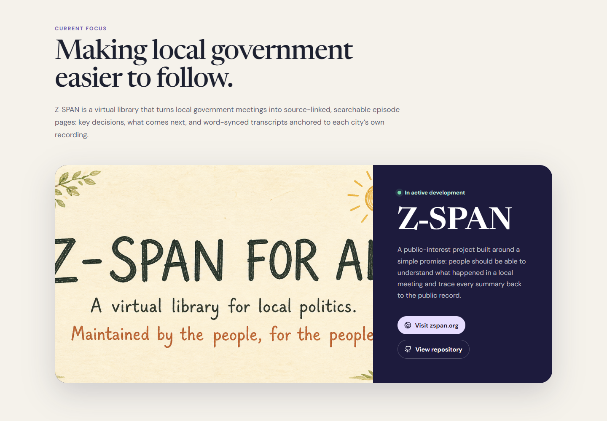
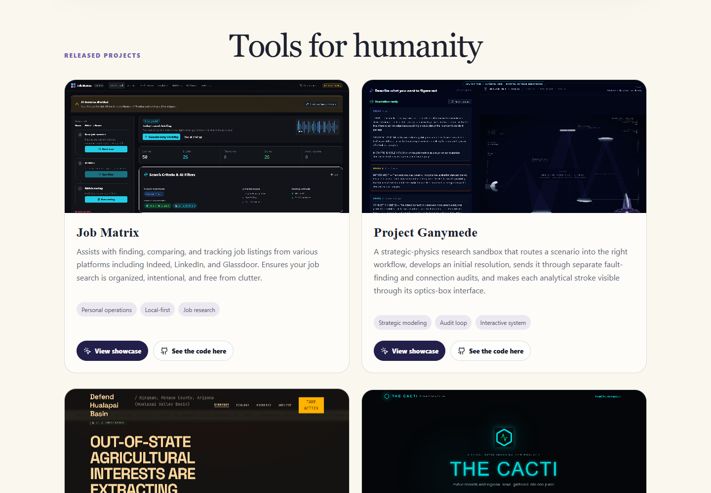

# James — public-interest systems portfolio

I build practical solutions to complicated problems.

From civic technology, tools to assist with job & career searches, experimental research workflows, open-source intelligence, or even advocacy sites, the goal is simple: turn complicated problems and scattered information into actionable results.



## What is here

The portfolio leads with [Z-SPAN](https://zspan.org), an active public-interest project that turns local government meetings into source-linked, searchable episode pages. It also collects seven source-available projects:



- [Job Matrix](https://github.com/anitacigawet/Job-Matrix) — a local-first job-search workspace.
- [Project Ganymede](https://github.com/anitacigawet/Project-Ganymede) — a layered strategic-reasoning workspace.
- [Fractal Framework](https://github.com/anitacigawet/fractal-framework) — a guided path from a local problem to source-cited advocacy.
- [The Cacti](https://github.com/anitacigawet/The-Cacti) — a self-hosted civic research workspace.
- [PrisonBreak](https://github.com/anitacigawet/PrisonBreak) — source-grounded case reading and attorney-question preparation.
- [Arizona Basin Monitor](https://github.com/anitacigawet/Water_Dashboard) — a synthetic interface prototype for Arizona water-basin monitoring.
- [Who Runs Arizona](https://github.com/anitacigawet/Who-Runs-Arizona) — a prototype for understanding Arizona's government structure.



## Design approach

The original portfolio's cloud-and-portal entrance remains the visual signature. The revealed experience was rebuilt around the actual work: verified links, real project screenshots, accessible navigation, clear project boundaries, and an explanation of the method connecting the projects.

The site is intentionally static. It has no account system, database, analytics, contact form, or secret-bearing runtime configuration.

## Run locally

Requirements: Node.js 22 or a compatible current LTS release.

```bash
npm install
npm run dev
```

Open `http://127.0.0.1:5173`.

## Verify a change

```bash
npm run check
npm test
npm run build
```

For screenshot capture, serve the production build at `http://127.0.0.1:4173`, then run:

```bash
npm run screenshots
```

## Project map

- `client/src/App.tsx` — page structure and portfolio narrative.
- `client/src/data/projects.ts` — released-project metadata.
- `client/src/styles.css` — responsive visual system.
- `client/public/projects/` — project screenshots and the Z-SPAN banner.
- `docs/ARCHITECTURE.md` — implementation and maintenance notes.

## Production deployment

The `main` branch deploys automatically through the Cloudflare Pages project `scootsolute-portfolio`. The production site is [scootsolute.org](https://scootsolute.org), with managed HTTPS and repository-defined security headers. GitHub Actions runs the tests and production build independently on every push.

## Contributions and maintenance

Suggestions and focused pull requests are welcome. See [CONTRIBUTING.md](CONTRIBUTING.md) for the project's boundaries. Publication does not promise a roadmap, response time, or continued maintenance.

## License

This is source-available software, not open-source software as defined by the Open Source Initiative.

Copyright 2026 ScootSolute LLC. Licensed under the [PolyForm Noncommercial License 1.0.0](LICENSE). Noncommercial use is permitted under its terms; commercial use requires separate permission.
